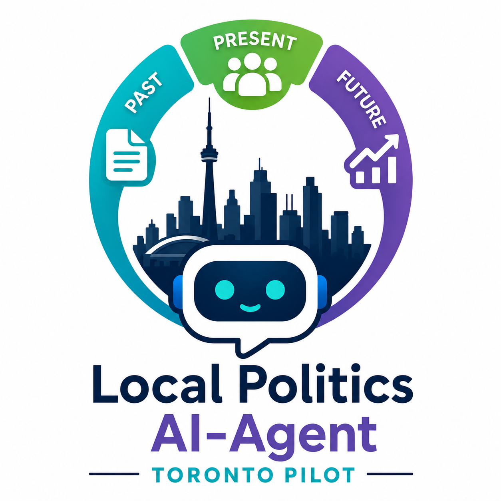

# About
The Local Politics AI Agent is an AI-powered municipal issue tracking and search framework that maps council records, meeting transcripts, Documenters notes, public reports, and news coverage into evidence-based timelines. This project is within the broader Political Accountability, Transparency, and Representation Oversight Network (PATRON) project (you can find out more about the PATRON work at https://github.com/patron-rotip).

The agent seeks to reconstruct the lifecycle of municipal issues across time. The project models local issues as evolving pathways that span proposals, consultations, reports, committee deliberations, council decisions, funding announcements, implementation milestones, stakeholder responses, and media coverage. Because these events are often distributed across multiple institutions, platforms, and information sources, understanding how a policy issue develops can be challenging for both citizens and journalists. The project therefore aims to improve transparency and access to municipal political processes.

# The Data Model and Framework
In order to answer questions concerning civic issues, the system integrates information from multiple source types, including City Council and committee records, meeting agendas and reports, official transcripts, agency and board documents, Documenters Canada notes, public records, and trusted news coverage. 

The model follows an event-based approach using a standardized metadata schema consisting of the date associated with the event, meeting, publication, or decision, the exact title of the source document, report, article, agenda item, or record, the type of civic event represented by the source (e.g., council motion, committee discussion, funding announcement, policy update, stakeholder response, media coverage), a concise, evidence-based statement directly, a class to represent the role of the source within the civic information ecosystem (e.g., agenda, city report, agency document, media source, stakeholder organization, advocacy group), and the public URL linking to the original source.
